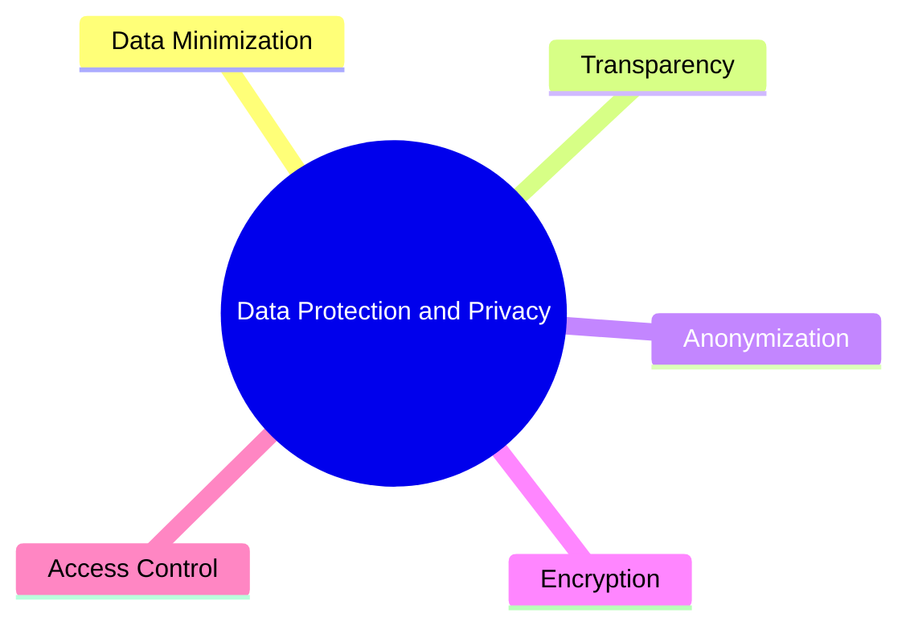
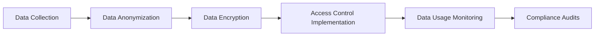
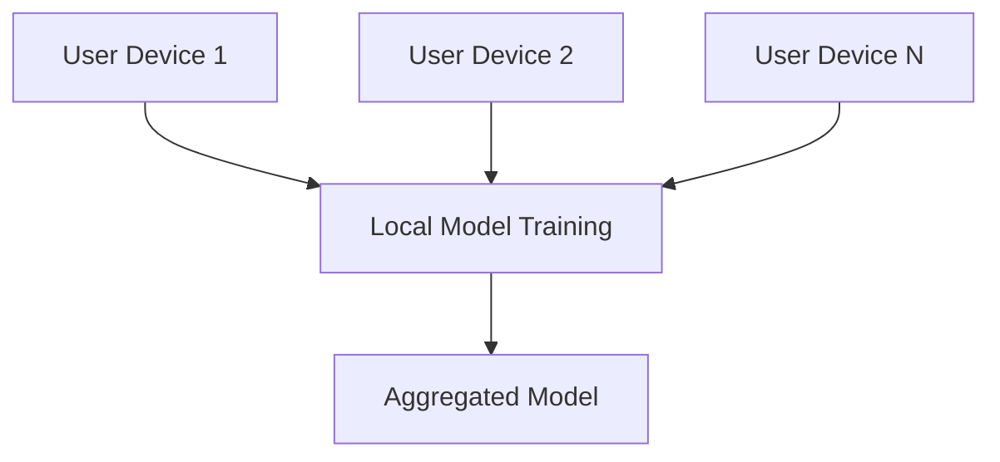
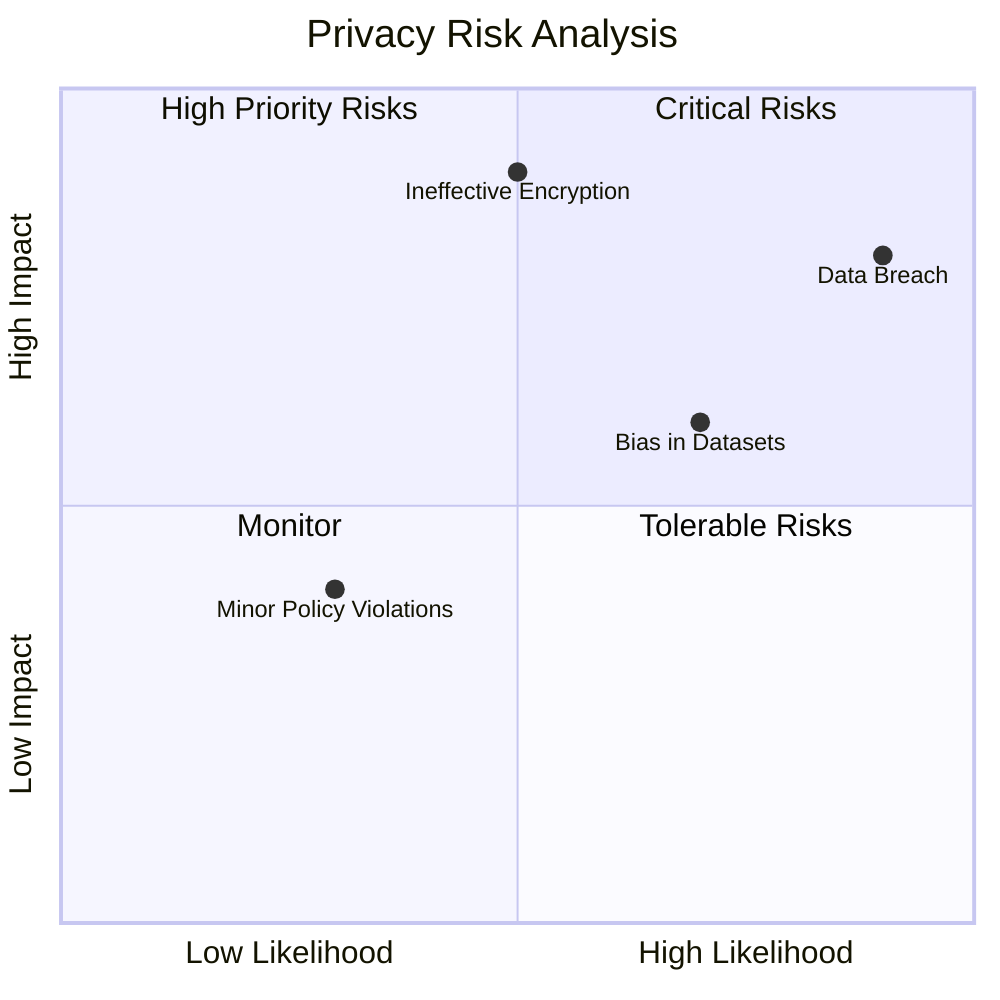
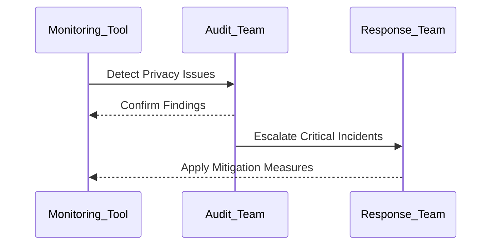

# Data Protection and Privacy in AI Systems  

## Introduction  

Data protection and privacy are critical aspects of AI systems, particularly when handling sensitive or regulated data. Ensuring privacy safeguards not only builds trust with users but also aligns AI systems with legal and regulatory frameworks such as GDPR, HIPAA, and CCPA. This page provides an in-depth overview of strategies, workflows, and tools to secure data and ensure privacy compliance throughout the AI lifecycle.  

---

## Objectives of Data Protection and Privacy  

1. **Secure Data**: Implement measures to protect data from breaches and unauthorized access.  
2. **Ensure Privacy**: Minimize risks associated with sensitive information through privacy-preserving techniques.  
3. **Comply with Regulations**: Adhere to global and industry-specific legal frameworks.  
4. **Foster Transparency**: Build trust with stakeholders by demonstrating privacy compliance.  

---

## Key Privacy and Data Protection Challenges  

| Challenge                 | Description                                                                   | Example Scenario                              |
|---------------------------|-------------------------------------------------------------------------------|----------------------------------------------|
| **Data Breaches**         | Unauthorized access to sensitive data.                                       | Hackers accessing customer data in a cloud database. |
| **Data Bias**             | Unrepresentative or skewed datasets leading to unfair outcomes.              | Discriminatory predictions in AI systems.    |
| **Regulatory Compliance** | Adherence to privacy laws like GDPR or HIPAA.                                | Fines due to failure to anonymize personal data. |
| **Data Sharing Risks**    | Privacy concerns when sharing data across organizations or jurisdictions.     | Cross-border data sharing under conflicting regulations. |

---

## Principles of Data Protection in AI  

1. **Data Minimization**: Collect only the data necessary for the intended purpose.  
2. **Transparency**: Clearly communicate how data will be used and processed.  
3. **Anonymization**: Remove identifiable information to protect privacy.  
4. **Encryption**: Secure data at rest and in transit using encryption protocols.  
5. **Access Control**: Limit access to sensitive data through robust identity and access management.  

---

## Data Protection Workflow  

A structured workflow ensures systematic data protection across the AI lifecycle:  

1. **Data Collection**: Gather data responsibly and ensure consent where applicable.  
2. **Data Anonymization**: Use techniques like differential privacy to protect sensitive information.  
3. **Data Encryption**: Secure data in storage and during transmission.  
4. **Access Control**: Enforce granular permissions to prevent unauthorized access.  
5. **Data Usage Monitoring**: Track how data is used to detect anomalies or policy violations.  
6. **Compliance Audits**: Periodically review data practices for regulatory alignment.  

---

## Techniques for Privacy-Preserving AI  

### Differential Privacy  

Adds noise to datasets or results to prevent individual data points from being identifiable.  

| Advantage                     | Limitation                              |
|-------------------------------|-----------------------------------------|
| Protects individual privacy   | May reduce accuracy of results         |
| Enables statistical analysis  | Requires careful tuning of noise levels|

---

### Federated Learning  

Trains models locally on devices without sharing raw data with a central server.  

| Advantage                     | Limitation                              |
|-------------------------------|-----------------------------------------|
| Maintains data locality       | Higher communication overhead          |
| Reduces data-sharing risks    | Complex implementation                 |

---

### Homomorphic Encryption  

Allows computations on encrypted data without decryption.  

| Advantage                     | Limitation                              |
|-------------------------------|-----------------------------------------|
| Preserves data confidentiality| High computational cost                |
| Enables secure collaboration  | Limited support in some frameworks     |

---

### Synthetic Data  

Creates artificial datasets that mimic real data for training models.  

| Advantage                     | Limitation                              |
|-------------------------------|-----------------------------------------|
| Avoids using real sensitive data | May not fully represent actual data distributions|
| Enables data sharing           | Requires expertise to generate         |

---

## Compliance with Privacy Regulations  

### Global Privacy Regulations  

| Regulation        | Key Requirement                                         | Example Measure                        |
|-------------------|--------------------------------------------------------|----------------------------------------|
| **GDPR (EU)**     | Data minimization, consent, and right to be forgotten.  | Enable users to delete their data.     |
| **CCPA (US)**     | Transparency in data usage and opt-out options.         | Provide data usage disclosures.        |
| **HIPAA (US)**    | Protect personal health information (PHI).              | Encrypt PHI in storage and transit.    |
| **PIPEDA (Canada)**| Accountability and consent for data collection.         | Anonymize personal data.               |

---

## Privacy and Security Tools  

| Tool/Service                  | Purpose                                   | Example Platforms                      |
|-------------------------------|-------------------------------------------|----------------------------------------|
| **Data Anonymization**        | Remove or mask identifiable data.         | Amnesia, ARX                           |
| **Data Encryption**           | Secure data during storage and transfer.  | AWS KMS, Azure Key Vault, Google KMS   |
| **Access Control**            | Enforce role-based data access policies.  | AWS IAM, Okta, Azure AD                |
| **Compliance Management**     | Track and ensure regulatory compliance.   | OneTrust, TrustArc, IBM Guardium       |

---

## Privacy Risk Assessment  

### Quadrant Analysis of Privacy Risks  

- **Critical Risks**: Data breaches, weak encryption protocols.  
- **High Priority Risks**: Dataset biases, incomplete compliance measures.  
- **Monitor**: Minor policy violations or edge cases.  
- **Tolerable Risks**: Low-likelihood, low-impact scenarios.  

---

## Monitoring and Continuous Improvement  

1. **Automated Monitoring**: Use tools like AWS Macie or Azure Purview for continuous tracking.  
2. **Regular Audits**: Schedule compliance audits to identify and fix gaps.  
3. **Incident Response**: Establish a response plan for data breaches or violations.  

---

## Best Practices  

1. **Data Minimization**: Avoid over-collection of sensitive data.  
2. **Anonymization by Design**: Incorporate anonymization techniques into workflows.  
3. **Regular Training**: Educate teams on data privacy and security standards.  
4. **Automation**: Use AI-driven tools to streamline privacy compliance.  
5. **Documentation**: Maintain detailed records of data handling and compliance activities.  

---

By implementing robust data protection and privacy practices, organizations can safeguard sensitive information, comply with regulations, and build trustworthy AI systems.  