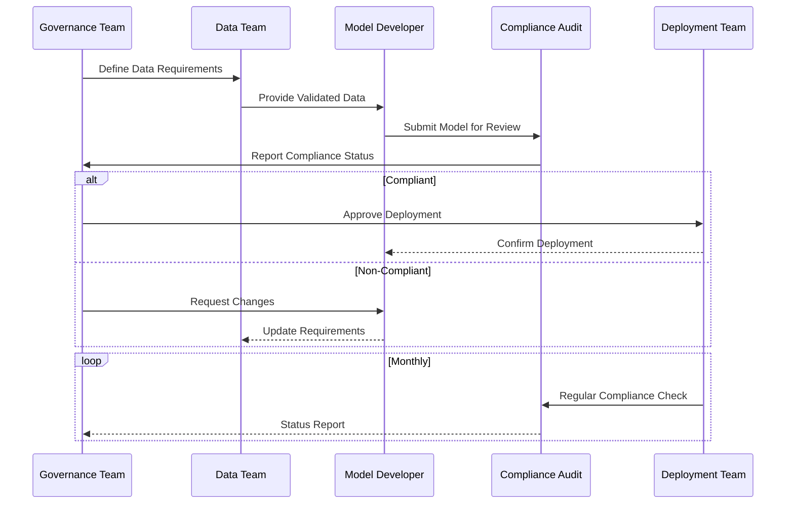
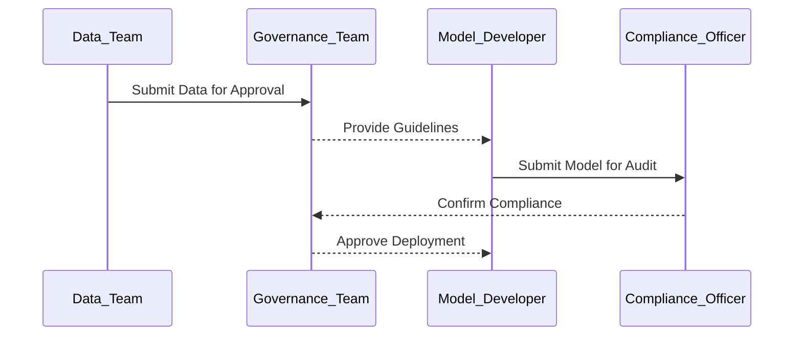
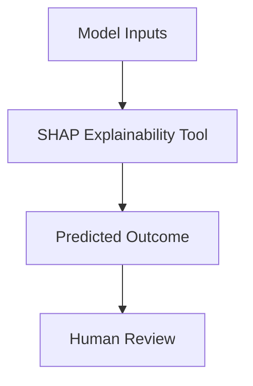
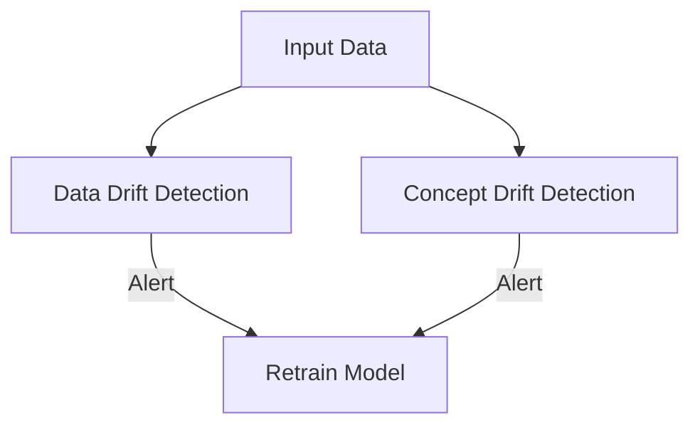
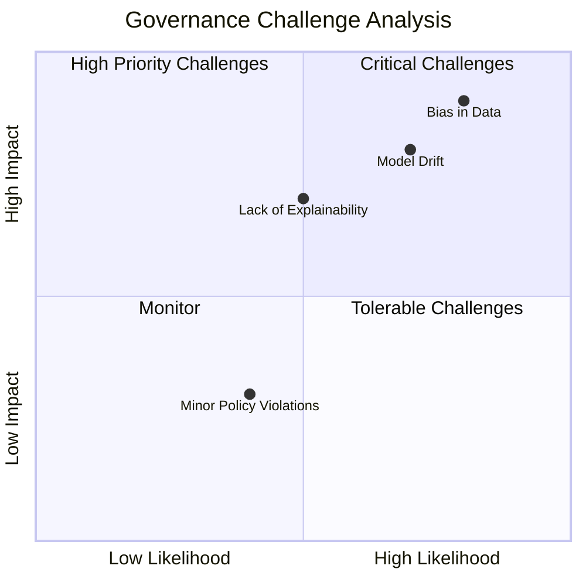
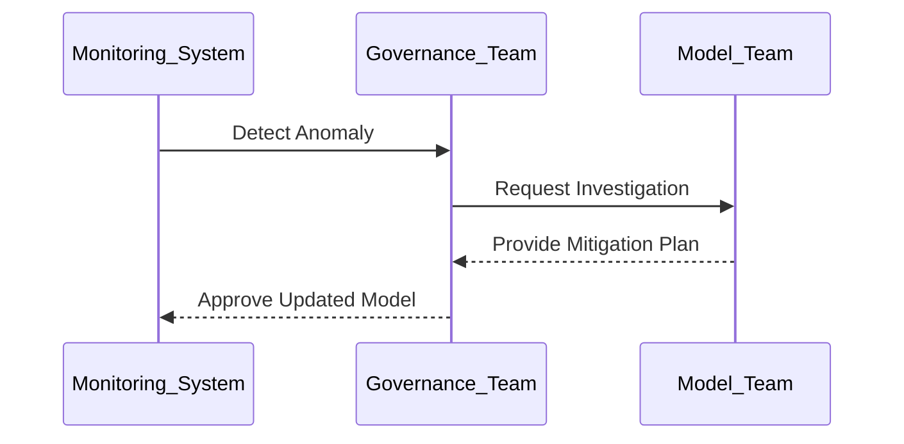

# Model Governance and Compliance  

## Introduction  

Model governance and compliance ensure that AI models are developed, deployed, and managed responsibly, aligning with legal, ethical, and organizational standards. By implementing robust governance practices, organizations can mitigate risks, maintain transparency, and ensure accountability in AI systems. This page explores the frameworks, workflows, and tools necessary to establish effective model governance and compliance strategies.  

---

## Objectives of Model Governance  

1. **Ensure Accountability**: Define roles and responsibilities for AI systems.  
2. **Mitigate Risks**: Address biases, drift, and other model risks proactively.  
3. **Maintain Transparency**: Provide insights into how models work and why decisions are made.  
4. **Align with Regulations**: Comply with industry-specific and global standards like GDPR, CCPA, and ISO 27001.  

---

## Key Challenges in Model Governance  

| Challenge                 | Description                                                                     | Example Scenario                              |
|---------------------------|---------------------------------------------------------------------------------|----------------------------------------------|
| **Model Bias**            | Models making unfair or discriminatory predictions.                            | Lending models denying loans to specific demographics. |
| **Lack of Explainability**| Difficulty understanding or interpreting model decisions.                      | Black-box AI systems in sensitive industries like healthcare. |
| **Regulatory Compliance** | Adhering to laws and ethical standards across jurisdictions.                   | Violations of GDPR for automated decisions.  |
| **Model Drift**           | Performance degradation over time due to changes in data distributions.         | Recommender systems becoming less effective due to evolving user preferences. |

---

## Model Governance Framework  

A robust governance framework involves managing the entire model lifecycle while ensuring compliance, fairness, and accountability.  

### Core Components  

1. **Version Control**: Track changes in data, code, and model configurations.  
2. **Bias and Fairness Assessment**: Evaluate and mitigate bias in data and predictions.  
3. **Explainability**: Make model decisions interpretable and understandable.  
4. **Compliance Audits**: Ensure models align with regulatory requirements.  
5. **Performance Monitoring**: Continuously evaluate and improve model performance.  

---

## Model Compliance Workflow  

A structured workflow ensures models meet governance and compliance standards throughout their lifecycle.  

---

## Tools and Techniques for Model Governance  

| Tool/Technique             | Purpose                                                                         | Example Solutions                      |
|----------------------------|---------------------------------------------------------------------------------|----------------------------------------|
| **Version Control**        | Track changes in models and datasets.                                          | DVC, MLflow, Git                      |
| **Bias Detection**         | Identify and measure biases in predictions.                                    | IBM AI Fairness 360, Microsoft Fairlearn |
| **Explainability Frameworks**| Provide insights into model predictions.                                      | SHAP, LIME, Google What-If Tool       |
| **Compliance Management**  | Track and manage adherence to regulations.                                     | OneTrust, Azure Purview               |
| **Monitoring Platforms**   | Continuously track model performance and drift.                                | Prometheus, Grafana, SageMaker Monitor|

---

## Techniques for Governance and Compliance  

### Bias and Fairness Assessments  

1. **Dataset Audits**: Evaluate data distributions for imbalances or biases.  
2. **Post-Prediction Analysis**: Use fairness metrics to assess model outcomes.  
3. **Bias Mitigation**: Apply techniques like re-weighting or synthetic balancing to reduce bias.  

---

### Explainability  

Explainability tools are essential for interpreting and validating model decisions, especially in regulated industries.  

| Tool                       | Use Case                                   | Industry Example                        |
|----------------------------|--------------------------------------------|-----------------------------------------|
| **SHAP (SHapley Additive ExPlanations)** | Feature importance visualization.                | Healthcare (predicting patient risk).   |
| **LIME (Local Interpretable Model-Agnostic Explanations)** | Explain individual predictions.                  | Finance (credit approval decisions).    |
| **Google What-If Tool**    | Simulate model changes and analyze effects.| Retail (personalized recommendations). |

---

### Model Drift Detection  

Model drift occurs when data distributions change, causing degraded model performance.  

- **Data Drift**: Monitor input data for significant shifts compared to training data.  
- **Concept Drift**: Detect changes in the relationship between inputs and outputs.  
- **Mitigation**: Retrain models periodically and set up alert thresholds.  

---

## Quadrant Analysis for Governance Challenges  

- **Critical Challenges**: Bias in data, lack of fairness.  
- **High Priority Challenges**: Model drift, explainability issues.  
- **Monitor**: Minor compliance violations or non-critical metrics.  
- **Tolerable Challenges**: Scenarios with limited impact and low probability.  

---

## Monitoring and Continuous Governance  

### Key Metrics  

| Metric                     | Description                                                                     |
|----------------------------|---------------------------------------------------------------------------------|
| **Accuracy**               | Measure of model performance on validation data.                               |
| **Fairness**               | Degree to which outcomes are unbiased across groups.                           |
| **Drift**                  | Amount of deviation in data or model behavior over time.                       |
| **Compliance Violations**  | Number of regulatory non-compliance incidents detected.                        |

### Incident Management Workflow  

---

## Best Practices  

1. **Integrate Governance Early**: Incorporate governance principles during model development.  
2. **Automate Monitoring**: Use automated tools to detect drift, bias, and compliance violations.  
3. **Transparent Reporting**: Share explainability insights and compliance reports with stakeholders.  
4. **Stakeholder Collaboration**: Involve diverse teams to ensure comprehensive governance.  
5. **Continuous Improvement**: Regularly update governance frameworks based on new challenges or regulations.  

---

## Conclusion  

Model governance and compliance are essential for building trustworthy, responsible, and effective AI systems. By adopting structured frameworks, leveraging advanced tools, and continuously monitoring performance, organizations can ensure that their AI systems align with ethical, regulatory, and business objectives.  

---

By implementing strong model governance practices, organizations can mitigate risks, enhance transparency, and ensure the ethical and effective use of AI.  