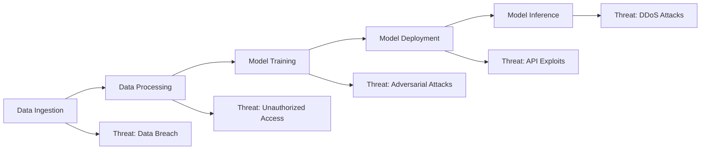
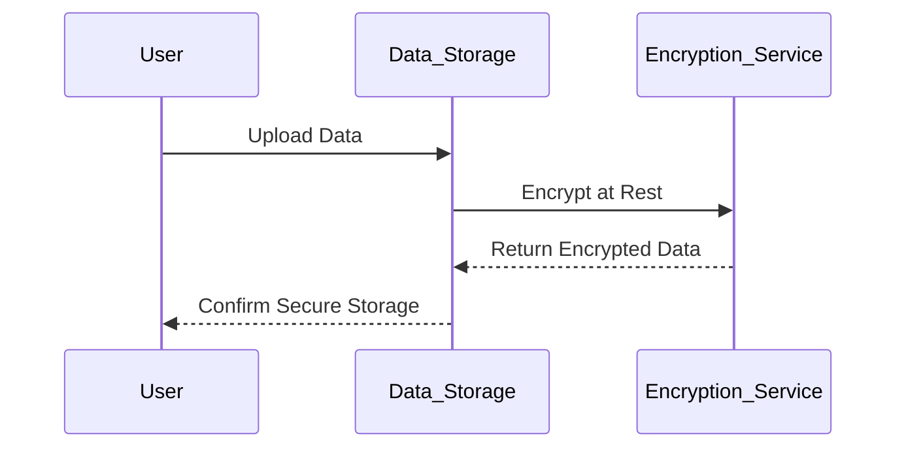
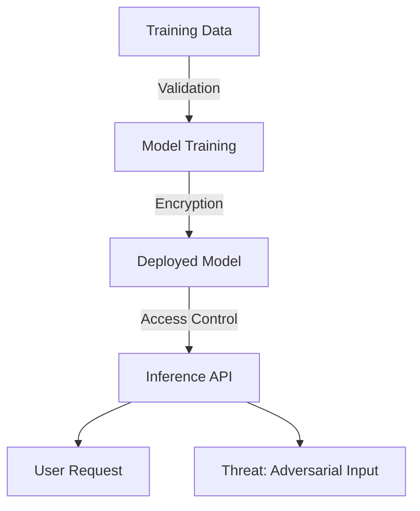
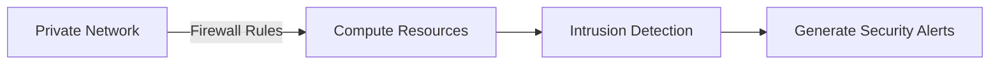
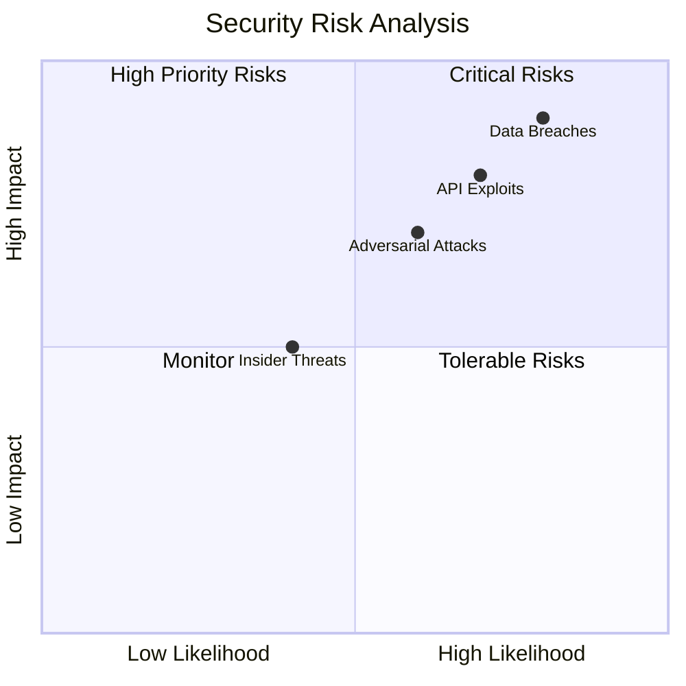
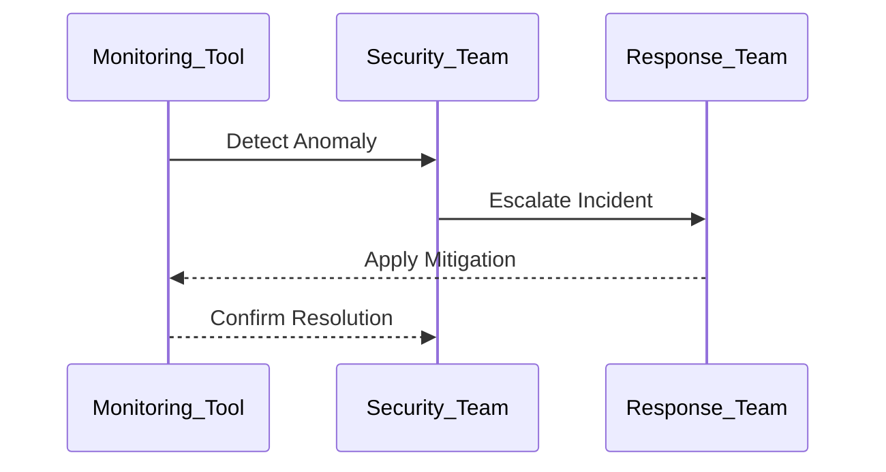

# Securing AI Pipelines and Infrastructures  

## Introduction  

Securing AI pipelines and infrastructures is critical to protecting data, models, and systems against unauthorized access, adversarial attacks, and operational failures. AI pipelines involve multiple stages, from data ingestion to model inference, and each stage introduces potential vulnerabilities. This page provides an in-depth look at the strategies, tools, and frameworks necessary to secure AI workflows and infrastructure across on-premises, cloud, and hybrid environments.  

---

## Objectives of Securing AI Pipelines  

1. **Protect Data**: Ensure data integrity and privacy throughout the pipeline.  
2. **Safeguard Models**: Prevent tampering with AI models during training and deployment.  
3. **Secure Infrastructure**: Harden compute, storage, and network resources against attacks.  
4. **Mitigate Threats**: Address adversarial attacks, insider threats, and operational risks.  
5. **Ensure Compliance**: Align pipelines with security and regulatory standards like GDPR and HIPAA.  

---

## Key Security Challenges  

| Challenge                 | Description                                                                     | Example Scenario                              |
|---------------------------|---------------------------------------------------------------------------------|----------------------------------------------|
| **Data Breaches**         | Unauthorized access to sensitive data.                                         | Exposed customer data due to unencrypted storage. |
| **Adversarial Attacks**   | Malicious inputs causing models to produce incorrect predictions.              | Altered images misleading AI-based security systems. |
| **Pipeline Compromise**   | Unauthorized modifications to data or models in transit.                       | Tampered data during ETL processes.          |
| **Insider Threats**       | Employees misusing access privileges.                                          | Data exfiltration by malicious insiders.     |
| **Infrastructure Exploits** | Exploiting vulnerabilities in compute or storage environments.                | Unauthorized access to cloud GPUs or VMs.    |

---

## Securing AI Pipeline Architecture  

### Stages of AI Pipelines and Their Vulnerabilities  

1. **Data Ingestion**: Vulnerable to interception or tampering during transmission.  
2. **Data Processing**: Risks of unauthorized access to intermediate datasets.  
3. **Model Training**: Susceptible to data poisoning and adversarial attacks.  
4. **Model Deployment**: Risks of exposed endpoints and unsecured APIs.  
5. **Inference**: Vulnerabilities in serving infrastructure, such as denial-of-service attacks.  

---

## Strategies for Securing AI Pipelines  

### 1. Data Security  

| Measure                   | Description                                                                     | Example Tools                       |
|---------------------------|---------------------------------------------------------------------------------|-------------------------------------|
| **Encryption**            | Encrypt data at rest and in transit.                                           | TLS, AWS KMS, Azure Key Vault       |
| **Access Control**        | Implement role-based access control (RBAC).                                    | IAM, Kubernetes RBAC                |
| **Data Masking**          | Anonymize sensitive data in transit and storage.                               | Data Masker, Amnesia                |
| **Integrity Verification**| Use cryptographic hashes to verify data integrity.                             | HashiCorp Vault, AWS Macie          |

---

### 2. Model Security  

| Threat                     | Mitigation Strategy                                                            | Example Tools                       |
|----------------------------|--------------------------------------------------------------------------------|-------------------------------------|
| **Adversarial Attacks**    | Train models with adversarial robustness techniques.                          | CleverHans, Foolbox                 |
| **Model Stealing**         | Limit API access and use query-rate limiting.                                 | AWS WAF, Cloudflare                 |
| **Model Poisoning**        | Validate training data integrity with anomaly detection.                      | SageMaker Monitor, Alibi Detect     |

---

### 3. Infrastructure Security  

#### Network Security  

- **Private Networks**: Use virtual private networks (VPCs) to isolate critical resources.  
- **Firewalls**: Restrict traffic to necessary endpoints using cloud-native firewalls.  
- **Intrusion Detection**: Monitor for unauthorized access or anomalies.  

#### Compute Security  

- **Least Privilege Access**: Restrict permissions to only necessary resources.  
- **Secure Containers**: Use signed and scanned container images.  
- **Resource Isolation**: Isolate workloads using Kubernetes namespaces or dedicated VMs.  

---

### 4. Continuous Monitoring  

Implement real-time monitoring to detect and mitigate threats in AI pipelines.  

| Metric                     | Description                                                                     | Monitoring Tool                     |
|----------------------------|---------------------------------------------------------------------------------|-------------------------------------|
| **Data Access Logs**       | Track who accessed data and when.                                              | AWS CloudTrail, Azure Monitor       |
| **API Activity**           | Monitor API usage patterns for anomalies.                                      | Prometheus, Datadog                 |
| **Model Performance**      | Identify potential drifts or security breaches.                                | Grafana, SageMaker Model Monitor    |

---

## Quadrant Analysis of Security Risks  

- **Critical Risks**: Data breaches and API exploits.  
- **High Priority Risks**: Adversarial attacks, unauthorized model access.  
- **Monitor**: Insider threats and minor operational issues.  
- **Tolerable Risks**: Low-likelihood, low-impact scenarios.  

---

## Incident Response Workflow  

A well-defined incident response process ensures quick mitigation of security breaches.  

---

## Tools for Securing AI Pipelines  

| Tool/Service                  | Purpose                                   | Example Providers                  |
|-------------------------------|-------------------------------------------|------------------------------------|
| **Encryption**                | Protect data at rest and in transit.      | AWS KMS, Azure Key Vault, Google KMS |
| **Access Management**         | Enforce RBAC and SSO.                    | AWS IAM, Okta, Azure AD            |
| **Adversarial Defense**       | Harden models against adversarial attacks.| CleverHans, Microsoft Counterfit   |
| **Intrusion Detection**       | Detect and respond to unauthorized access.| AWS GuardDuty, Splunk, Azure Sentinel|
| **Container Security**        | Secure containerized AI pipelines.        | Kubernetes RBAC, Docker Security   |

---

## Best Practices  

1. **Encrypt Everything**: Apply encryption to data, models, and APIs at all stages.  
2. **Limit Access**: Use RBAC to ensure that only authorized users can access sensitive resources.  
3. **Monitor Continuously**: Set up real-time monitoring and logging for all pipeline activities.  
4. **Harden Infrastructure**: Use secure configurations for containers, networks, and compute resources.  
5. **Regular Audits**: Conduct periodic security reviews and vulnerability assessments.  

---

## Conclusion  

Securing AI pipelines and infrastructures is a critical step in ensuring the reliability, integrity, and trustworthiness of AI systems. By adopting comprehensive strategies and leveraging advanced tools, organizations can safeguard their AI workflows against evolving threats and align with security best practices and compliance standards.  

---

By implementing robust security measures, organizations can build resilient AI systems that are secure, compliant, and ready to handle modern challenges.  