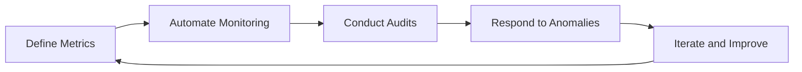
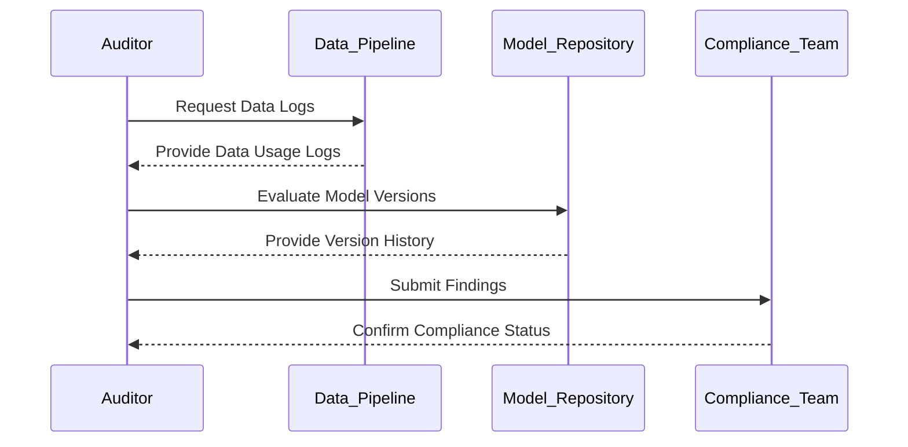
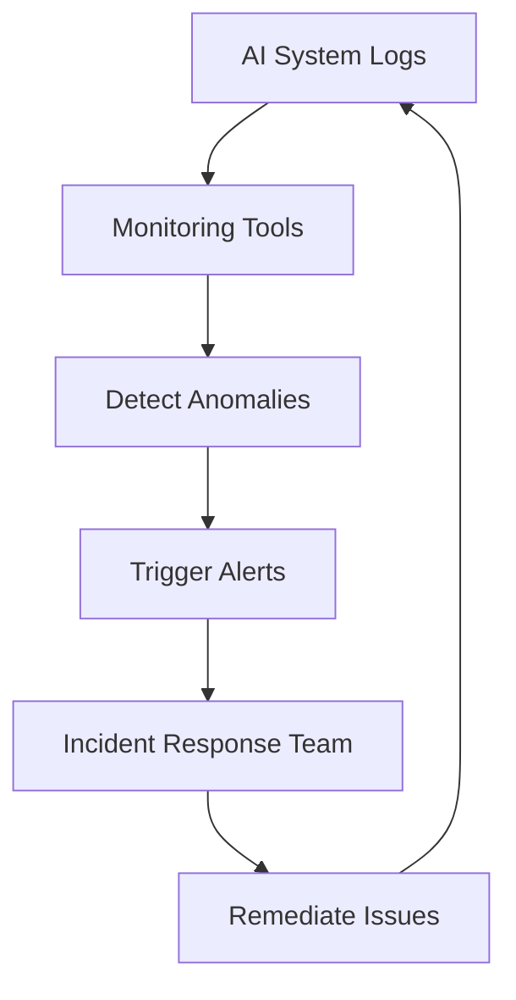
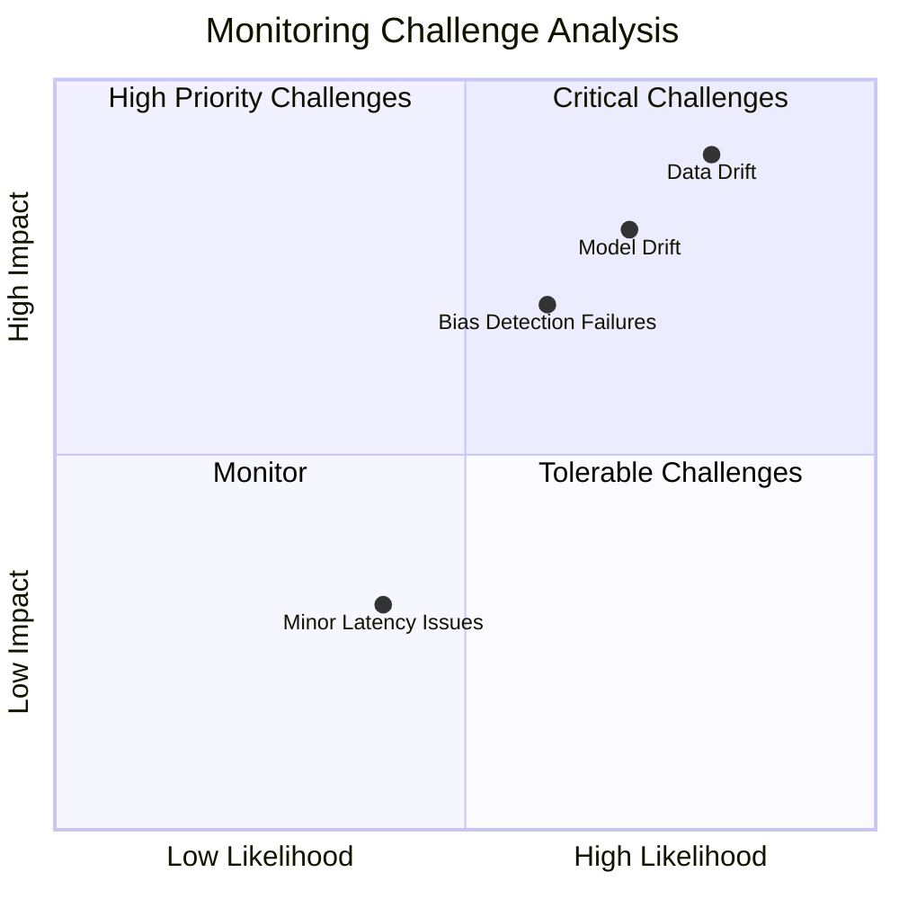
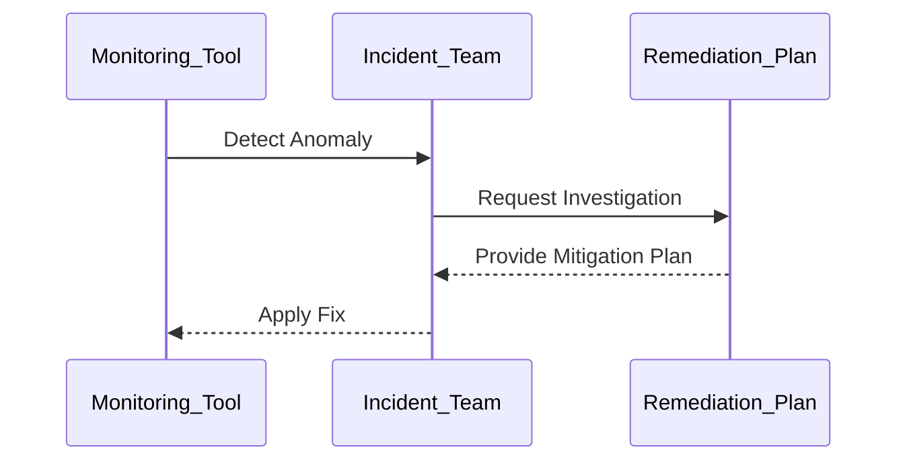

# Auditing and Monitoring AI Systems  

## Introduction  

Auditing and monitoring are essential components of managing AI systems to ensure they operate as intended, remain compliant with regulations, and maintain performance and fairness. Regular audits provide accountability and transparency, while continuous monitoring helps detect and address issues like drift, bias, or security vulnerabilities in real time.  

This page explores strategies, workflows, and tools for effective auditing and monitoring of AI systems, covering the full lifecycle from data collection to model deployment and inference.  

---

## Objectives of Auditing and Monitoring  

1. **Ensure Compliance**: Verify that AI systems adhere to regulatory, ethical, and organizational standards.  
2. **Track Performance**: Monitor key metrics such as accuracy, latency, and throughput.  
3. **Detect Bias and Drift**: Identify unintended biases or changes in model performance over time.  
4. **Respond to Incidents**: Quickly address anomalies and failures to minimize impact.  
5. **Maintain Transparency**: Provide clear documentation and logs for stakeholders.  

---

## Challenges in Auditing and Monitoring  

| Challenge                 | Description                                                                     | Example Scenario                              |
|---------------------------|---------------------------------------------------------------------------------|----------------------------------------------|
| **Data Drift**            | Changes in input data distributions that reduce model performance.              | Fraud detection model becomes less effective due to evolving patterns. |
| **Model Drift**           | Changes in the relationship between inputs and outputs.                         | Recommender systems lose relevance over time.|
| **Bias in Predictions**   | Models making unfair or discriminatory predictions.                             | HR systems favoring specific demographics.   |
| **Compliance Violations** | Non-adherence to data privacy and usage laws.                                   | Failure to anonymize personal data under GDPR. |
| **Lack of Explainability**| Difficulty interpreting or justifying model predictions.                        | Black-box AI systems in regulated industries.|

---

## Framework for Auditing and Monitoring AI Systems  

Auditing and monitoring involve establishing processes and tools across the AI lifecycle:  

1. **Define Metrics**: Identify the key metrics for monitoring model and data health.  
2. **Automate Monitoring**: Use tools to track metrics in real time and trigger alerts.  
3. **Conduct Audits**: Periodically review system logs, performance reports, and compliance status.  
4. **Respond to Anomalies**: Investigate and remediate issues as they arise.  
5. **Iterate and Improve**: Use insights from monitoring and audits to improve systems.  

---

## Key Metrics for Monitoring  

| Metric                     | Description                                                                     | Example Tools                       |
|----------------------------|---------------------------------------------------------------------------------|-------------------------------------|
| **Accuracy**               | Measures model correctness.                                                    | SageMaker Monitor, Vertex AI Monitoring |
| **Latency**                | Tracks response time for predictions.                                          | Prometheus, Grafana                 |
| **Drift Detection**        | Monitors shifts in data or model performance.                                   | Alibi Detect, AWS Model Monitor     |
| **Fairness and Bias**      | Evaluates fairness across demographic groups.                                   | IBM Fairness 360, Microsoft Fairlearn |
| **Compliance Metrics**     | Tracks adherence to regulatory requirements.                                    | Azure Purview, OneTrust             |

---

## Auditing AI Systems  

### Audit Workflow  

A structured audit workflow ensures comprehensive evaluation of AI systems.  

---

### Key Audit Areas  

1. **Data Audit**  
   
      - Verify data sources and ensure compliance with regulations.  
      - Check for biases or anomalies in datasets.  

2. **Model Audit**  
   
      - Review model training logs for reproducibility.  
      - Assess explainability and interpretability of predictions.  

3. **Process Audit**  
   
      - Evaluate governance processes for adherence to best practices.  
      - Check logs for unauthorized access or modifications.  

---

## Continuous Monitoring  

Continuous monitoring helps identify and resolve issues in real time, ensuring AI systems remain reliable and compliant.  

### Real-Time Monitoring Workflow  

---

### Tools for Monitoring AI Systems  

| Tool/Service                  | Purpose                                   | Example Providers                  |
|-------------------------------|-------------------------------------------|------------------------------------|
| **Performance Tracking**      | Monitor model accuracy and latency.       | Prometheus, Datadog, Grafana       |
| **Drift Detection**           | Identify shifts in data or model behavior.| SageMaker Monitor, Vertex AI Monitor |
| **Anomaly Detection**         | Detect outliers or unusual patterns.      | Alibi Detect, Azure Anomaly Detector |
| **Compliance Management**     | Track regulatory adherence.               | OneTrust, TrustArc, IBM Guardium   |
| **Log Management**            | Store and analyze logs for audits.        | ELK Stack, Splunk                  |

---

## Quadrant Analysis of Monitoring Challenges  

- **Critical Challenges**: Data and model drift.  
- **High Priority Challenges**: Bias detection failures.  
- **Monitor**: Minor latency and throughput anomalies.  
- **Tolerable Challenges**: Non-critical operational issues.  

---

## Incident Management for AI Systems  

### Incident Response Workflow  

### Best Practices  

1. **Automate Alerting**: Set up real-time alerts for critical anomalies.  
2. **Regular Testing**: Simulate incidents to evaluate response readiness.  
3. **Document Resolutions**: Maintain detailed logs of incidents and their resolutions.  

---

## Best Practices for Auditing and Monitoring  

1. **Define Clear Metrics**: Establish measurable criteria for monitoring and audits.  
2. **Automate Workflows**: Use tools to streamline monitoring and reduce manual effort.  
3. **Collaborate Across Teams**: Involve data scientists, engineers, and compliance officers in audits.  
4. **Regularly Update Systems**: Adapt monitoring tools to evolving threats and requirements.  
5. **Ensure Explainability**: Use explainability frameworks to provide transparency in monitoring outputs.  

---

## Conclusion  

Auditing and monitoring are integral to ensuring the reliability, compliance, and fairness of AI systems. By adopting structured workflows, leveraging advanced tools, and implementing continuous monitoring, organizations can build AI systems that are transparent, accountable, and trustworthy.  

---

By integrating auditing and monitoring practices into AI workflows, organizations can ensure the robustness and accountability of their AI systems while maintaining compliance and ethical standards.  