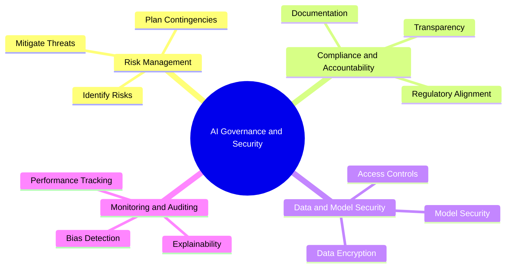
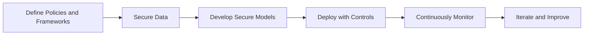
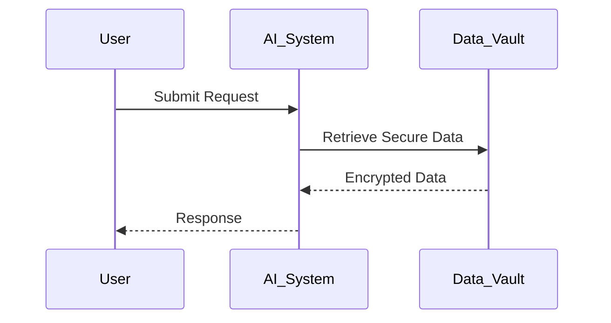
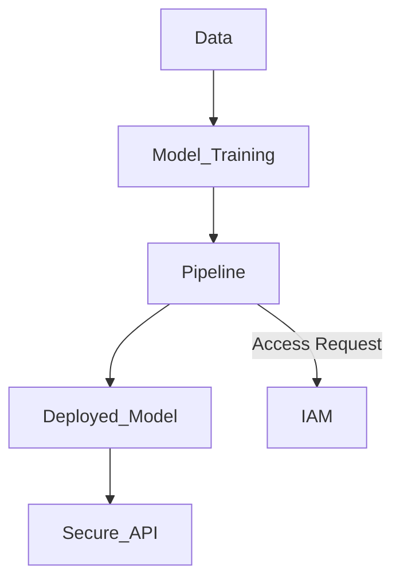

# AI Governance and Security  

## Introduction  

AI Governance and Security are foundational to building responsible, trustworthy, and resilient AI systems. With the increasing adoption of AI, organizations face challenges around risk management, data privacy, compliance, and securing AI pipelines. This section provides a comprehensive framework for governing AI systems while ensuring their security and ethical alignment.  

### Objectives of AI Governance and Security  

1. **Mitigate Risks**: Identify and address risks associated with AI, including biases, adversarial attacks, and operational failures.  
2. **Ensure Compliance**: Align AI systems with legal and regulatory frameworks such as GDPR, CCPA, and ISO standards.  
3. **Protect Data and Privacy**: Safeguard sensitive data across the AI lifecycle, from ingestion to inference.  
4. **Secure Infrastructure**: Protect AI pipelines and infrastructure against malicious activities.  
5. **Maintain Trust**: Build transparent, auditable, and accountable AI systems to foster user and stakeholder trust.  

---

## AI Governance and Security Framework  

The framework for AI governance and security involves four critical dimensions:  

1. **Risk Management**: Proactively identify, assess, and mitigate AI-specific risks.  
2. **Compliance and Accountability**: Ensure AI systems adhere to ethical, legal, and organizational standards.  
3. **Data and Model Security**: Safeguard data and models throughout their lifecycle.  
4. **Monitoring and Auditing**: Continuously monitor AI systems to ensure performance, fairness, and compliance.  

---

## Key Components of AI Governance and Security  

| Component                 | Description                                                                     | Example Frameworks or Tools                      |
|---------------------------|---------------------------------------------------------------------------------|-------------------------------------------------|
| **AI Risk Management**    | Identifying, assessing, and mitigating risks at each stage of the AI lifecycle. | ISO 31000, NIST Risk Management Framework        |
| **Data Protection**       | Ensuring data privacy and security during storage, processing, and sharing.     | GDPR, CCPA, AWS Macie, Azure Purview            |
| **Model Governance**      | Establishing controls for model development, deployment, and monitoring.        | IBM OpenScale, Google Model Cards               |
| **Infrastructure Security** | Protecting AI pipelines and compute environments from attacks.                 | Kubernetes RBAC, AWS IAM, Azure Defender         |
| **Monitoring and Auditing**| Tracking AI system performance, detecting anomalies, and ensuring compliance.   | Prometheus, Grafana, Splunk AI                  |

---

## AI Governance and Security Lifecycle  

### Stages of AI Governance and Security  

1. **Define Policies and Frameworks**: Set governance policies, standards, and risk management frameworks.  
2. **Secure Data**: Implement data privacy protocols, encryption, and access control mechanisms.  
3. **Develop Secure Models**: Use tools and techniques to ensure fairness, robustness, and security.  
4. **Deploy with Controls**: Integrate monitoring and access restrictions during deployment.  
5. **Continuously Monitor**: Audit models for drift, performance issues, and compliance violations.  

---

## Strategic Focus Areas  

### Risk Assessment and Management  

Proactively managing AI risks requires tools, frameworks, and strategies to identify vulnerabilities and create mitigation plans.  

| Risk Type                | Description                                                                     | Example Scenario                                 |
|--------------------------|---------------------------------------------------------------------------------|-------------------------------------------------|
| **Bias Risk**            | Models producing unfair or discriminatory outcomes.                            | AI system biased against certain demographics.  |
| **Adversarial Attacks**  | Manipulated inputs causing incorrect predictions.                              | Altered stop sign confusing an autonomous car.  |
| **Operational Failures** | AI systems underperforming in real-world conditions.                           | Chatbots unable to handle user queries during peak times. |

---

### Data Protection and Privacy  

AI systems must protect sensitive data and comply with privacy regulations. Key practices include:  

1. **Data Minimization**: Collect only the data necessary for the AI system.  
2. **Anonymization and Encryption**: Use techniques like differential privacy and data masking.  
3. **Access Control**: Implement robust identity and access management (IAM) policies.  

---

### Model Governance and Compliance  

Ensuring models are developed and deployed responsibly involves implementing governance controls and aligning with regulations.  

| Practice                  | Description                                                                     | Example Tool                     |
|---------------------------|---------------------------------------------------------------------------------|----------------------------------|
| **Version Control**       | Maintain detailed records of model changes.                                    | MLflow, DVC                     |
| **Explainability**        | Ensure models provide interpretable outputs.                                   | SHAP, LIME                      |
| **Fairness Audits**       | Conduct regular bias and fairness assessments.                                 | IBM Fairness 360, Fairlearn     |

---

### Securing AI Pipelines and Infrastructure  

AI pipelines must be secured to protect against unauthorized access, data breaches, and insider threats.  

| Security Measure          | Description                                                                     | Example Tool or Service           |
|---------------------------|---------------------------------------------------------------------------------|-----------------------------------|
| **Authentication and IAM**| Use identity management to restrict access to sensitive resources.              | AWS IAM, Azure Active Directory  |
| **Data Encryption**       | Encrypt data at rest and in transit.                                            | TLS, AWS KMS, Azure Key Vault    |
| **Role-Based Access**     | Define granular permissions for users and services.                             | Kubernetes RBAC                  |

---

### Auditing and Monitoring AI Systems  

Continuous auditing and monitoring ensure that AI systems remain secure, performant, and aligned with governance objectives.  

1. **Anomaly Detection**: Use monitoring tools to identify outliers in data or model behavior.  
2. **Drift Management**: Detect shifts in data distribution or model performance.  
3. **Logging and Reporting**: Maintain detailed logs for audits and compliance reporting.  

---

## Next Steps  

Explore the subsections for a deeper dive into AI Governance and Security:  

1. [AI Risk Assessment and Management](01-AI-Risk-Assessment-and-Management.md): Understand how to identify and mitigate risks throughout the AI lifecycle.  
2. [Data Protection and Privacy in AI Systems](02-Data-Protection-and-Privacy-in-AI-Systems.md): Learn best practices for safeguarding sensitive data.  
3. [Model Governance and Compliance](03-Model-Governance-and-Compliance.md): Discover tools and techniques for responsible AI development.  
4. [Securing AI Pipelines and Infrastructures](04-Securing-AI-Pipelines-and-Infrastructures.md): Explore how to secure AI workflows and infrastructure.  
5. [Auditing and Monitoring AI Systems](05-Auditing-and-Monitoring-AI-Systems.md): Learn how to monitor, audit, and ensure compliance for AI systems.  

By implementing a comprehensive approach to AI governance and security, organizations can build robust, ethical, and trustworthy AI systems that meet business and regulatory demands.  