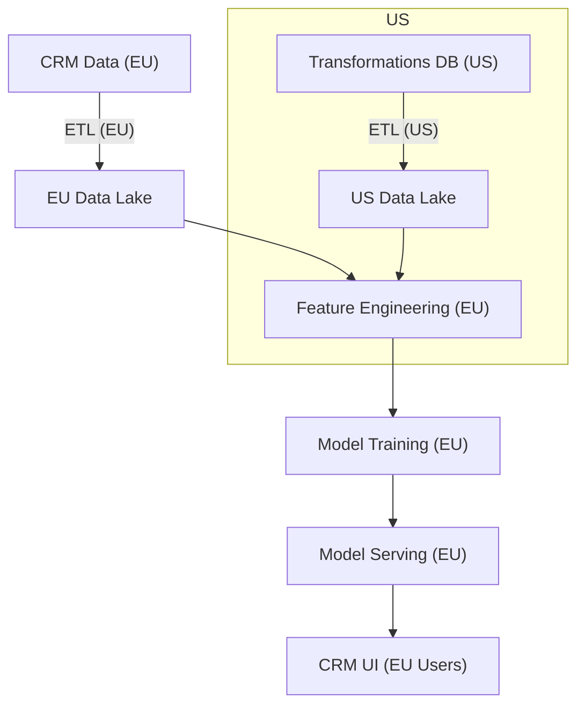
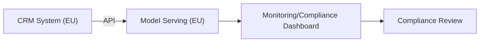

# AI Enterprise Solution Design & Compliance Template

**Instructions:**  
*Use this template as a strategic blueprint for designing AI solutions within an enterprise setting. Each section includes guidance and placeholders to help you align your AI initiatives with business goals, comply with global/regional regulations (e.g., EU AI Act, GDPR, HIPAA, CCPA), and maintain an auditable, transparent record of all changes. The template is intended to be a living document that evolves as regulations, technologies, and business priorities change.*

---

## 1. Executive Summary

**Purpose:** Offer a high-level overview of the AI initiative, its business rationale, and core objectives, ensuring alignment with corporate strategy and regulatory environments.

| **Item**               | **Details**                                                                      |
|------------------------|----------------------------------------------------------------------------------|
| Project Name           | *e.g., Customer Churn Prediction System*                                          |
| Executive Sponsor      | *Name/Title (e.g., Chief Data Officer)*                                           |
| Business Context       | *Describe the market challenge/opportunity (e.g., high churn in EU markets).*     |
| Objectives             | *List specific targets (e.g., reduce churn by 15% in EU, improve NPS globally).*  |
| Geographical Scope     | *Enumerate regions served (e.g., EU, US, APAC) and applicable laws.*              |

*Guidance:* This section sets the stage. Revisit it regularly if business goals or regulatory conditions (e.g., expansion into a new region) change.

---

## 2. Business Architecture

**Purpose:** Ensure the AI solution is aligned with corporate strategy, clearly defining roles, responsibilities, and how compliance and governance fit into business objectives.

### 2.1 Business Goals & Metrics

| **Goal**    | **Description**                               | **KPI/Metric**                   |
|-------------|-----------------------------------------------|----------------------------------|
| *Goal 1*    | *Reduce EU churn by 15% within 12 months.*     | *Churn Rate, Retention %*         |
| *Goal 2*    | *Improve NPS by 10 points in US region.*       | *NPS (by region), CSAT*           |

*Guidance:* Tie goals to quantifiable metrics. Update as business priorities shift or new regulations alter success criteria.

### 2.2 Stakeholders & Roles (RACI Matrix)

| **Role**               | **Name/Team** | **R/A/C/I** | **Responsibilities**                          |
|------------------------|---------------|-------------|-----------------------------------------------|
| Executive Sponsor       | [Name]        | A           | Approve strategy, budget, ensure compliance    |
| AI Architect            | [Name]        | R           | Oversee end-to-end AI design & integration     |
| Data Scientist          | [Team]        | R           | Model dev, validation, bias/fairness checks    |
| MLOps Engineer          | [Team]        | R           | CI/CD, logging changes, versioning models      |
| Data Engineer           | [Team]        | R           | Ingest/process data, ensure data lineage        |
| Responsible AI Officer  | [Team]        | C           | Oversee ethical standards, EU AI Act readiness |
| Legal & Compliance Team | [Team]        | C           | Interpret laws (EU AI Act, GDPR, etc.)          |
| IT Manager              | [Team]        | I           | Infrastructure & security alignment             |
| End Users (Ops/CRM)     | [Dept]        | I           | Consume results, give feedback                  |

*Guidance:* If regulations change, update the RACI matrix to add new roles or responsibilities (e.g., Data Protection Officer).

### 2.3 Compliance & Regulatory Context

| **Regulation/Act** | **Applicability**          | **Key Requirements**                                |
|--------------------|---------------------------|----------------------------------------------------|
| EU AI Act           | EU Operations             | Risk classification, transparency, human oversight |
| GDPR                | EU Personal Data          | Consent, data minimization, DSAR compliance        |
| HIPAA (US)          | Health Data in US         | Data privacy, strict access controls, audit logs    |
| CCPA (California)   | Personal Data in California| Opt-outs, data disclosure requests                 |

*Guidance:* Continuously update this table as your business expands into new regions or new laws (e.g., Brazil’s LGPD) become relevant.

---

## 3. Data Architecture

**Purpose:** Define data sources, governance, and residency with an emphasis on traceability and compliance. Ensure the architecture supports audits (e.g., who accessed data, where it’s stored).

### 3.1 Data Inventory & Residency

| **Data Source**   | **Type**            | **Region**       | **Owner**    | **Quality Checks**         |
|-------------------|---------------------|------------------|--------------|----------------------------|
| CRM System (EU)    | Customer Profiles   | Frankfurt (EU)   | CRM Team     | Null checks, duplicates    |
| Trans. DB (US)     | Purchase History    | Virginia (US)    | E-Comm Team  | Schema validation, outliers|
| External APIs       | Demographics       | Global           | Vendor       | Reliability, freshness     |

*Guidance:* Document data lineage and verify that regional data processing complies with local laws (e.g., EU data stored in EU data centers).

### 3.2 Governance & Data Lineage

| **Policy**            | **Description**                           | **Tools/Frameworks**        |
|-----------------------|-------------------------------------------|-----------------------------|
| Data Stewardship       | Assign data stewards per domain/region    | Data Catalog (Collibra)     |
| Lineage Tracking       | Track transformations, downstream usage    | Apache Atlas, OpenLineage   |
| Retention & Purging    | Retain/purge per legal requirements        | Automated scripts, region-based policies |

*Guidance:* Maintaining robust lineage helps demonstrate compliance to auditors and supports future changes (e.g., if laws mandate data deletion).

### 3.3 Data Flow Diagram

*Guidance:* Show how data never leaves certain regions if that’s required by local laws (e.g., GDPR data stays in the EU).

---

## 4. Application Architecture

**Purpose:** Detail all system components and interactions, including model development, integration points, and how compliance/ethics checks are embedded into workflows.

### 4.1 Components & Interfaces

| **Component**            | **Description**                        | **Interface/Protocol**       |
|--------------------------|----------------------------------------|------------------------------|
| Data Ingestion Service    | Ingest & normalize data by region       | Batch/Streaming (Kafka, APIs)|
| Model Training Pipeline   | Train models, log experiments/versions | Python SDK, MLflow           |
| Model Serving API         | Real-time prediction endpoint           | REST/GRPC                    |
| Integration Layer (CRM)   | Deliver predictions to CRM system       | RESTful Endpoints, Webhooks  |
| Monitoring & Dashboards   | Observe performance, compliance metrics | Web UI (HTTPS)               |

*Guidance:* For each component, describe how logs are captured and stored for auditing (e.g., model outputs, data used, changes made).

### 4.2 MLOps & Lifecycle Management

| **Process**              | **Description**                           | **Tooling**                |
|--------------------------|-------------------------------------------|----------------------------|
| Model Versioning          | Track models, data & code versions       | MLflow, DVC, Git           |
| Automated Testing         | Check data quality, bias & fairness       | Great Expectations, Fairlearn|
| CI/CD & Deployment        | Continuous integration & regional deployment | Jenkins, GitHub Actions     |
| Compliance Logging         | Record all changes, training data, performance | ELK Stack, Cloud Logging    |

*Guidance:* Ensure MLOps pipelines integrate compliance checks at each step (e.g., block deployment if a bias threshold is exceeded).

### 4.3 Interaction Diagram

*Guidance:* Show where compliance teams can access logs and reports.

---

## 5. Technology Architecture

**Purpose:** Outline infrastructure, security, and networking decisions, ensuring they align with data residency and compliance requirements.

### 5.1 Infrastructure & Cloud Services

| **Layer**       | **Description**                           | **Services/Tools**        |
|-----------------|-------------------------------------------|---------------------------|
| Compute          | Region-specific GPU instances (EU, US)   | AWS EC2 (EU), GCP (US)     |
| Storage          | Localized Data Lakes                     | AWS S3 (EU region), Azure (EU) |
| Containerization | Region-specific Kubernetes clusters       | Kubernetes, Helm          |
| Orchestration    | Region-aware pipelines                    | Airflow, Kubeflow          |

*Guidance:* Strictly enforce data residency rules at the infrastructure level (e.g., no cross-region data movement).

### 5.2 Security & Networking

| **Measure**         | **Description**                                    | **Tools/Standards**      |
|---------------------|----------------------------------------------------|--------------------------|
| IAM & RBAC          | Least privilege by region/role                     | AWS IAM, Azure AD        |
| Encryption          | Data at rest/in transit, region-specific keys       | KMS, TLS/SSL             |
| Network Segmentation | Logical separation of EU and US data flows         | VPCs, Firewalls, VPNs     |

*Guidance:* Security measures must adapt to changes in regional requirements or emerging threats.

---

## 6. Implementation & Phasing

**Purpose:** Provide a roadmap for phased implementation, with compliance checkpoints integrated into each phase.

### 6.1 Phases & Milestones

| **Phase** | **Description**                         | **Milestones**                        | **Timeline** |
|-----------|-----------------------------------------|---------------------------------------|-------------|
| Phase 1   | Data Prep & Compliance Setup            | EU Data Lake online, compliance checks configured | Month 1-2 |
| Phase 2   | Model Development & Validation          | Baseline model, bias/fairness tests passed        | Month 3-4 |
| Phase 3   | Integration & Deployment                | Model served in EU environment, logs validated   | Month 5-6 |
| Phase 4   | Testing & Audit Dry Run                 | Conduct mock EU AI Act audit, fix gaps            | Month 7   |
| Phase 5   | Production Go-Live & Monitoring         | Go-live in EU, continuous compliance monitoring   | Month 8   |

*Guidance:* Insert compliance reviews at the end of each phase to catch issues early.

### 6.2 Migration Strategy

| **Step**       | **Description**                          | **Owner**          |
|----------------|------------------------------------------|--------------------|
| Assessment      | Evaluate existing systems/data laws       | IT Manager, Legal  |
| Migration Prep  | Develop region-specific migration scripts | Data Engineer      |
| Staging Test    | Validate compliance logs in staging       | QA, Compliance Team|
| Execute & Validate | Perform migration, confirm no data leaves allowed regions | IT Manager, Data Eng. |
| Post-Migration Monitoring | Continuous checks & improvements | MLOps Engineer, Ops |

*Guidance:* Include rollback plans if compliance checks fail during migration.

---

## 7. Risk Management & Model Governance

**Purpose:** Identify and mitigate regulatory and operational risks, including non-compliance with global frameworks.

### 7.1 Risk & Mitigation

| **Risk**                | **Impact**                           | **Probability** | **Mitigation**                                |
|-------------------------|---------------------------------------|-----------------|-----------------------------------------------|
| Non-Compliance (EU AI Act) | High: Legal & financial penalties    | Medium          | Regular audits, documentation, human oversight |
| Data Privacy Breach      | High: Legal/reputational damage       | Medium          | Encryption, IAM, periodic security reviews     |
| Model Bias               | Medium: Unfair decisions              | High            | Bias tests, retraining, diverse datasets       |
| Data Residency Violation | High: Regulatory fines                | Medium          | Strict geofencing, audit logs, routine checks  |

*Guidance:* Reassess risks periodically, especially if new frameworks (e.g., new state privacy laws) are introduced.

### 7.2 Ethical & Explainable AI

| **Aspect**          | **Action**                                   | **Tooling**       |
|---------------------|----------------------------------------------|-------------------|
| Explainability       | Document model logic, provide SHAP/LIME      | SHAP, LIME         |
| Fairness Checks      | Regular bias assessments, corrective actions | Fairlearn, Aequitas|
| Documentation        | Log decision rationale, model changes        | MLflow, Confluence |

*Guidance:* Maintaining thorough documentation helps satisfy audits from multiple frameworks.

---

## 8. Regulatory & Audit Framework Alignment

**Purpose:** Provide a structured approach to track and align with multiple frameworks and laws, supporting ongoing governance of AI changes.

### 8.1 Framework Mapping & Control Matrix

| **Framework/Act**  | **Type**      | **Relevant Project Stages**           | **Required Artifacts**               | **Update Frequency** |
|--------------------|---------------|---------------------------------------|--------------------------------------|---------------------|
| EU AI Act           | AI Regulation | Model Dev, Deployment, Operations     | Risk classification, decision logs, human oversight docs | Quarterly or upon model changes |
| GDPR                | Data Privacy  | Data Collection, Storage, Retention   | Consent records, DSAR logs, pseudonymization proof | Continuous, monthly audits |
| HIPAA               | Health Data   | Data Processing, Storage (US)         | Access logs, PHI masking strategies, incident reports | Monthly or after infra changes |
| CCPA                | Data Privacy  | US Customer Data Handling              | Opt-out request logs, transparency reports | As requested, yearly audit |

*Guidance:* Extend this table as you add more frameworks. For each regulation:  

- Identify applicable project stages (data ingestion, model training, deployment).  
- Specify artifacts required (logs, documentation, model sheets).  
- Define how often to review and update these artifacts.

### 8.2 Compliance Change Management

| **Change Trigger**     | **Action**                              | **Owner**              |
|------------------------|------------------------------------------|------------------------|
| New Law/Framework       | Add new rows to Framework Matrix, update RACI, adjust pipelines | Legal & Compliance Team |
| Model Update/Versioning | Review EU AI Act compliance, re-run bias tests, update logs      | MLOps Engineer, Data Scientist |
| Infrastructure Update   | Check data residency compliance, re-verify encryption keys       | IT Manager, Ops          |

*Guidance:* Treat compliance changes as a continuous improvement process. Have version-controlled documentation (e.g., Git repo for compliance docs) and keep a changelog of regulatory updates.

### 8.3 Audit Readiness & Evidence Repository

| **Artifact**           | **Location**           | **Access Control**         |
|------------------------|------------------------|----------------------------|
| Model Training Logs     | MLflow/Cloud Storage  | Restricted to Data Sci, Compliance |
| Compliance Reports      | Confluence/Wiki       | Legal, Compliance, Audit Teams  |
| Security Incident Logs  | SIEM Tool (e.g., Splunk) | SecOps, Compliance         |

*Guidance:* Maintain a central evidence repository. Auditors should find what they need easily. Tag artifacts with relevant frameworks for quick reference.

---

## 9. Methodologies & Best Practices

**Purpose:** Align with industry-standard frameworks (CRISP-DM, DataOps, MLOps) and best practices, integrating compliance at each step.

| **Stage**           | **Activity**                        | **Compliance Check**                |
|---------------------|--------------------------------------|-------------------------------------|
| Business Understanding | Set metrics/goals                 | Confirm alignment with relevant laws |
| Data Preparation     | Clean, transform data               | Validate no violation of data residency |
| Modeling             | Train & validate model              | Check bias, fairness, document lineage |
| Evaluation           | Assess performance vs. KPIs         | Ensure logs meet EU AI Act guidelines |
| Deployment (MLOps)   | Automate delivery & ops             | Compliance gates in CI/CD pipeline   |
| Monitoring & Maintenance | Track performance, retrain models | Ongoing audits, evidence updates    |

*Guidance:* Insert “compliance checkpoints” throughout the lifecycle.

---

## 10. Appendices

### 10.1 Glossary

| **Term**      | **Definition**                                          |
|---------------|----------------------------------------------------------|
| EU AI Act      | EU regulation for AI risk classification & oversight    |
| DSAR           | Data Subject Access Request (GDPR right)                |
| PHI            | Protected Health Information (under HIPAA)             |
| DVC            | Data Version Control (tool for tracking data changes)   |

### 10.2 References & Resources

- **EU AI Act Documentation:** [Link]  
- **GDPR Guidelines:** [Link]  
- **HIPAA Compliance Overview:** [Link]  
- **CCPA Resources:** [Link]  
- **CRISP-DM Guide:** [Link]  
- **MLOps Frameworks:** [Link to Kubeflow, MLflow docs]

*Guidance:* Update references as laws and frameworks evolve.

---

## 11. Revision History

Revisit this template regularly as business operations expand, laws change, and new compliance frameworks arise. This template is designed for iterative updates, ensuring that any AI-related changes (new models, changed data pipelines, adjusted infrastructures) remain governed, compliant, and audit-ready, sir.